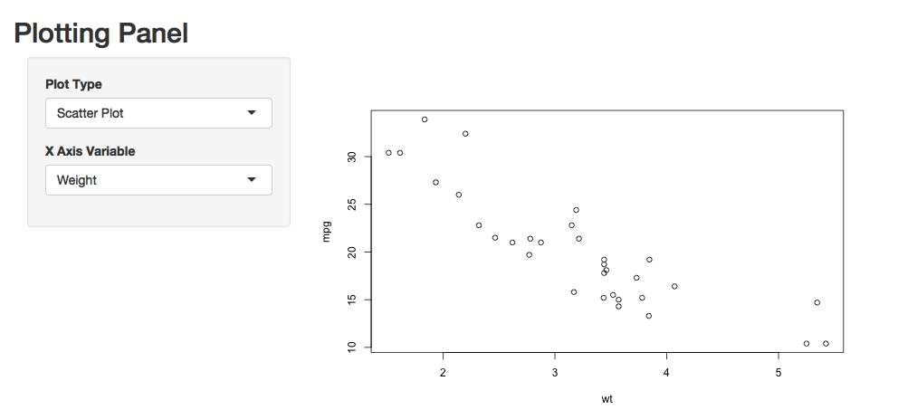

```{r, echo=FALSE}
library(webshot)
appshot(app = "app/", file = "app.png", vheight = 300)

```

### Code of ui.R

```{r, cache=FALSE, echo=FALSE}
knitr::read_chunk("app/ui.R")
```

```{r ui, eval=FALSE}
```

### Code of server.R

```{r, cache=FALSE, echo=FALSE}
knitr::read_chunk("app/server.R")
```

```{r server, eval=FALSE}
```


