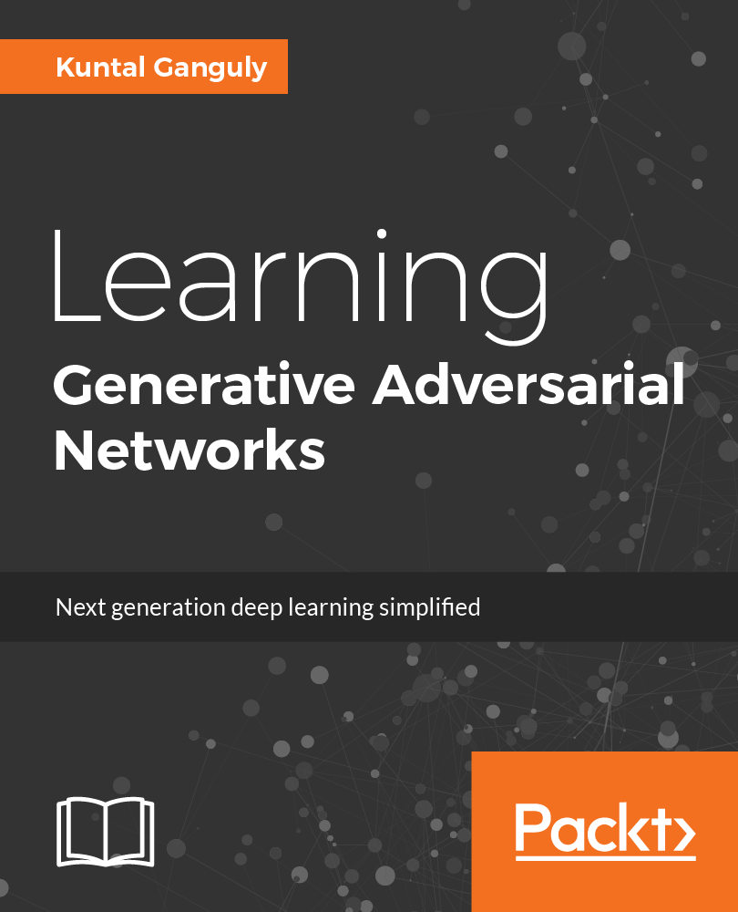

# Learning Generative Adversarial Networks
### Build image generation and semi-supervised models using Generative Adversarial Network

Generative models are gaining a lot of popularity among the data scientists, mainly because they facilitate the building of AI systems that consume raw data from a source and automatically builds an understanding from it. Unlike supervised learning methods, generative models do not require labelling of the data which makes it an interesting system to use. This book will help you to build and analyze the deep learning models and apply them to real-world problems. This book will help readers develop intelligent and creative application from a wide variety of dataset (mainly focusing on visual or images). This book will consists of Python codes that can be directly applied and used in an industrial context and not just academic. Through this book readers will be trained to build GAN models and use them in a production environment.

## Get the book
<table style="width:100%" >
  <tr>
    <td></td>
    <td>
 
**Key Features of the book**

* Understand the basics of Deep Learning and how it can be used for creativity.
* Generate images and how to build semi-supervised model using Generative Adversarial Network(GAN) with real world datasets
* Tune GAN models by addressing the challenges such as mode collapse, training instability using mini batch, feature matching, boundary equilibrium technique.
* Use stacking with Deep Learning architecture to run and generate images from text.
* Coupling multiple Generative models to discover relation across various domains
* Using Transfer Learning and Pre-Trained models with GANs over distributed system to generate high quality images.
* Explore various steps to deploy deep models in production

   </td>
  </tr>
</table>

# R Data Analysis Cookbook - Second Edition
### A journey from Data Analysis to Data Driven Insights

Dive into the world of data science and data analysis leveraging the power of R and analytics to transform data into actionable insights. This book will teach you how you can put your data analysis and machine learning skills in R to practical use, with recipes catering to the basic as well as advanced data analysis tasks. Right from acquiring your data and preparing it for analysis to the more complex data analysis techniques, the book will show you how you can implement each technique in the best possible manner.By the end of this book, you will have all the knowledge you need to become an expert in data analysis with R, and put your skills to test in real-world scenarios. I will also be adding various R scripts and bonus content here from time to time. Keep watching this space!

## Get the book
<table style="width:100%" >
  <tr>
    <td></td>
    <td>
 
**Key Features of the book**

* Acquire, format and visualize your data using R
* Using R to perform an Exploratory data analysis
* Introduction to machine learning algorithms such as regression and classification
* Advance Clustering technique- Kmeans (its variant), CLARA, PAM, DBSCAN
* Get started with social network analysis
* Real world dataset example- Fraud Detection and Image Recognition
* Building Recomendation system- Collaborative Filtering, Content based and Hybrid
* Generate dynamic reporting with Shiny and Knitr
* Get started with geospatial analysis
* Handling large data with R using Spark and MongoDB

    </td>
  </tr>
</table>

